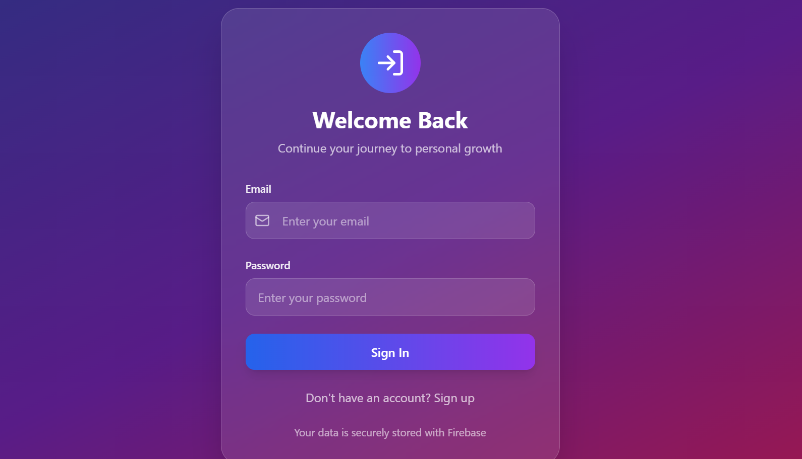
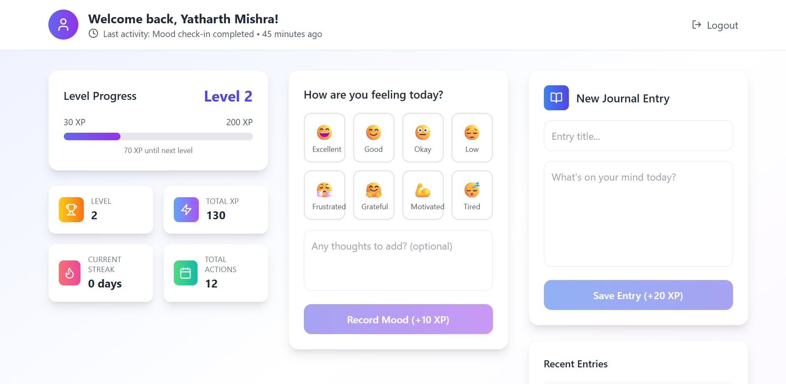

# 🎮 Game Dashboard App

This is a gamified journaling and mental health tracking dashboard built using **React**, **TypeScript**, **Firebase**, and **Tailwind CSS**. It allows users to log journal entries, track their moods, and receive achievement notifications in a game-like interface.

---
## 📸 Screenshots
### 🔐 Login Page

### 🏠 Dashboard View

---
## 🚀 Features

- ✅ User Authentication with Firebase
- ✍️ Mood Check-ins and Journal Entries
- 🏆 Gamification and Achievements
- 📊 User Stats Dashboard
- 🔐 Protected Routes (requires login)

---

## 📁 Project Structure

project/
├── src/
│ ├── components/ # UI components
│ ├── config/ # Firebase config
│ ├── hooks/ # Custom React hooks
│ ├── services/ # Firebase service functions
│ ├── types/ # TypeScript interfaces
│ └── App.tsx # Main app component
├── .env.example # Example environment config
├── package.json # Project dependencies and scripts
└── vite.config.ts # Vite configuration

## 🧰 Tech Stack

- **React + TypeScript**
- **Firebase (Auth, Firestore, Storage)**
- **Tailwind CSS**
- **Vite** (build tool)

## ⚙️ Getting Started

### 1.Clone the Repository

git clone https://github.com/Yatharth1401/Gamified_User_Dashboard.git
cd project

### 2. Install Dependencies

npm install

### 3. Firebase Project Setup

1. Go to [Firebase Console](https://console.firebase.google.com/)
2. Create a new project or select existing one
3. Enable Authentication:
   - Go to Authentication > Sign-in method
   - Enable "Email/Password" provider
4. Create Firestore Database:
   - Go to Firestore Database
   - Create database in production mode
   - Choose your preferred location

### 4. Get Firebase Configuration

1. Go to Project Settings (gear icon)
2. Scroll down to "Your apps" section
3. Click "Add app" and select Web (</>) 
4. Register your app and copy the config object

### 5. Environment Setup
*This contain link to my firebase So Replace It with yours*

Update .env file in the root of the project/ directory. Use the template below:

VITE_FIREBASE_API_KEY=your_api_key
VITE_FIREBASE_AUTH_DOMAIN=your_project.firebaseapp.com
VITE_FIREBASE_PROJECT_ID=your_project_id
VITE_FIREBASE_STORAGE_BUCKET=your_project.appspot.com
VITE_FIREBASE_MESSAGING_SENDER_ID=your_sender_id
VITE_FIREBASE_APP_ID=your_app_id
VITE_FIREBASE_MEASUREMENT_ID=your_measurement_id

### 6. Update Firebase Config

Update `src/config/firebase.ts` with your environment variables:

### 7. Start the Development Server

npm run dev
Your app should now be running at http://localhost:5173

## Deployment
ou can deploy this app using platforms like Netlify, Vercel, or Firebase Hosting. Make sure to set the same environment variables in your deployment environment.

## Author

Developed by Yatharth Mishra
Feel free to contribute or open issues